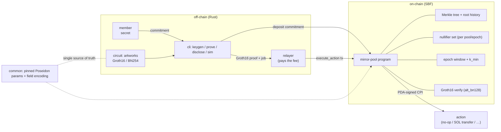

# mirror-pool

[](https://github.com/solanabr/mirror-pool/actions/workflows/ci.yml)
&nbsp;License: MIT &nbsp;·&nbsp; Rust · arkworks Groth16/BN254 · native Solana

**Compliant behavioral-anonymity for Solana.** mirror-pool is a shared
anonymity-set protocol — **not a fund mixer**. Members join a pool; when any
member triggers a protocol interaction (a swap, a stake, …), the action is
executed on-chain by the **pool program's PDA**, gated by a zero-knowledge proof
of pool membership. Observers see that *an* action happened but cannot attribute
it to a specific member. A larger pool and tighter per-epoch synchronization
mean stronger anonymity for everyone.

Architecturally this is an Elusiv/Tornado-style anonymity set (a Merkle tree of
commitments, epoch-scoped nullifiers, and a Groth16 membership proof),
generalized from "the right to withdraw funds" to "the right to trigger an
action this epoch." **The PDA — not the member — is the on-chain actor**, and
that indirection is the core unlinkability primitive.

> **Status:** all eight milestones complete — membership circuit, on-chain
> Groth16 verification (~98k CU), incremental tree + deposits, nullifiers +
> `execute_action`, epochs, fee-paying relayer, a real integration, and the
> compliance layer. See [`ARCHITECTURE.md`](./ARCHITECTURE.md) for the design and
> threat model, and run [`./demo.sh`](./demo.sh) for the full flow on a local SVM.

## How it works



An observer sees the relayer's transaction and *that* an action happened, but
the actor is the pool PDA and the fee payer is the relayer — nothing links back
to the member beyond the epoch's anonymity set.

## Everything is Rust

On-chain program, ZK circuit + prover, relayer, and CLI are all Rust. The
circuit uses [arkworks](https://arkworks.rs) (Groth16 over BN254) — **not
Circom** — and on-chain proof verification uses
[`groth16-solana`](https://github.com/Lightprotocol/groth16-solana) via the
`alt_bn128` syscalls. There is no GUI; consumers are developers, agents, and
other programs.

## Design differentiators & eligibility

Stated as facts about this design, not comparisons:

- **Rust end to end** — arkworks circuit + Rust prover, **no Circom / snarkjs /
  JS** anywhere. (Explicit eligibility property for the Rust-only bounty.)
- **Native `solana-program`** — no Anchor or other framework; the program is
  hand-written for tight compute (~98k CU verification).
- **Compliance dimension** — beyond privacy, a Privacy-Pools-style **association
  set** with a real ZK inclusion proof plus viewing-key selective disclosure: a
  *separating equilibrium* where honest users prove clean provenance and the
  anonymity metric is reported over the attested set.
- **Grounded anonymity metric** — min-entropy effective-k over the association
  set (not a naive count), derived from the primary literature and honest about
  the Sybil gap (see [`ARCHITECTURE.md`](./ARCHITECTURE.md#references)).
- **Runs on a real validator** — deploys with `--arch v3` and the full flow runs
  against the deployed program over RPC (validated on a local Agave validator;
  live devnet pending faucet funding — see below).

## Threat model (summary)

Privacy here is *behavioral* and *probabilistic*: your anonymity is exactly the
set of members who could plausibly have triggered the same action in the same
epoch. mirror-pool is explicit about what it does and does not defend against
(full treatment in [`ARCHITECTURE.md`](./ARCHITECTURE.md)):

- **Fee-payer linkage** — if the member's own wallet paid the action fee, the
  action is trivially attributable. Mitigation: a mandatory fee-paying
  **relayer** (SPEC §4.4). Self-relaying defeats the protocol.
- **Single-member epochs** — an anonymity set of one is no anonymity. Mitigation:
  epoch windows that batch actions; the CLI `sim` reports the achieved set size,
  and thin epochs are surfaced, not hidden.
- **Timing correlation** — deposit→action timing and cross-epoch behavior can
  re-link a member. Mitigation: epoch batching; documented residual leakage.
- **Amount/dust correlation** — for value-carrying actions, unique amounts leak.
  Documented; denomination guidance provided per integration.

An overclaimed privacy guarantee is worse than an accurate one; the docs err
toward honesty about residual leakage.

## Compliance is first-class

- **Viewing keys / selective disclosure** — a member can grant a designated
  auditor the ability to learn which actions *they* initiated, without weakening
  anyone else's anonymity.
- **Deposit-screening hook** — pluggable, off by default, able to reject entries
  based on an attestation/allowlist.

The framing is **compliant behavioral privacy with selective disclosure**, not
evasion.

## Workspace

```
common/    # shared types + pinned Poseidon params (single source of truth)
circuit/   # arkworks membership circuit + prover
program/   # native Solana program (tree, nullifiers, epochs, PDA execution, compliance)
relayer/   # off-chain fee-paying relayer + epoch batcher
cli/       # keygen / deposit / prove / execute / disclose / sim
```

## Build & test

Toolchain (pinned; the versions this repo is developed and CI-tested against):

- Rust stable (see [`rust-toolchain.toml`](./rust-toolchain.toml))
- Solana/Agave CLI providing `cargo build-sbf` (platform-tools ≥ v1.54)

```sh
# Host build, lints, and the full test suite (includes the Poseidon
# circuit↔chain equality test).
cargo test --workspace --all-features
cargo fmt --all -- --check
cargo clippy --workspace --all-targets --all-features -- -D warnings

# Compile the on-chain program to SBF bytecode.
cargo build-sbf --manifest-path program/Cargo.toml
```

## Quickstart

Run the entire protocol end-to-end — real SBF bytecode, real Groth16 proofs, on
an in-process local SVM (litesvm), no external validator:

```sh
./demo.sh
```

It builds the program, verifies a proof on-chain under the CU budget, runs the
full flow (initialize → deposit → open epoch → no-op action via the pool PDA →
real SOL transfer → close epoch, with every negative rejected), exercises the
compliance layer, and shows the CLI.

### CLI (`mirror-pool`)

```sh
cargo build -p mirror-pool-cli
BIN=target/debug/mirror-pool

# One-time dev trusted setup (writes proving/verifying keys + on-chain VK bytes).
$BIN setup --out-dir artifacts

# A member generates a secret and deposits its commitment.
$BIN keygen                       # -> secret + commitment
$BIN deposit  --rpc-url <URL> --keypair <RELAYER.json> \
              --program-id <PID> --pool-authority <AUTH> --commitment <HEX>

# Build a membership proof into a relay job (offline), then a relayer submits it.
$BIN prove    --proving-key artifacts/proving_key.bin --leaves leaves.txt \
              --secret <HEX> --epoch 1 --selector 0 --out action.job
$BIN execute  --rpc-url <URL> --keypair <RELAYER.json> \
              --program-id <PID> --pool-authority <AUTH> --job action.job

# Selective disclosure to an auditor, and the anonymity-set simulation.
$BIN keygen --auditor             # -> auditor viewing keypair
$BIN disclose --secret <HEX> --auditor-pubkey <HEX>
$BIN sim --members 64 --actors 12 --epochs 3
```

The offline commands (`setup`, `keygen`, `prove`, `disclose`, `sim`) need no
network. `deposit`/`execute` submit to the given RPC; `execute` goes through a
relayer so the member never pays the fee.

### Deploy & run against a real validator

The program **deploys and runs on a real Agave validator** — build with
`--arch v3` (the sBPF version current clusters enable; the default `v0` is not
yet feature-gated on-chain and fails `program deploy`):

```sh
cargo build-sbf --manifest-path program/Cargo.toml --arch v3
solana program deploy target/deploy/mirror_pool_program.so   # prints the Program Id

# Drive the full flow over RPC (localhost or devnet):
PID=<program id>
$BIN init-pool --program-id $PID --keypair <auth.json> --k-min 2
$BIN deposit   --program-id $PID --keypair <auth.json> --pool-authority <AUTH> --commitment <HEX>
$BIN crank     --program-id $PID --keypair <auth.json> --action open
$BIN prove     --proving-key artifacts/proving_key.bin --leaves leaves.txt --secret <HEX> --epoch 1 --out action.job
$BIN execute   --program-id $PID --keypair <relayer.json> --pool-authority <AUTH> --job action.job
```

**Deployment status.** This exact sequence has been run end-to-end against a
local `solana-test-validator` (a real Agave 4.1.1 validator): the deployed
program initialized a pool, accepted deposits, opened an epoch, and executed a
relayer-paid `execute_action` (on-chain proof verification + PDA-signed CPI).
**Live devnet is deferred**: the devnet CLI faucet was rate-limited during this
work, so the deployed devnet Program Id is pending funding — fund the address
printed by `solana address` (web faucet) and re-run the two commands above with
`--url devnet`. See [`VALIDATION-RESULTS.md`](./VALIDATION-RESULTS.md) L4.

## Instruction error codes

Failures return `ProgramError::Custom(n)` ([`program/src/error.rs`](./program/src/error.rs)):

| n | Name | Meaning |
|---|------|---------|
| 0 | InvalidInstructionData | instruction bytes could not be decoded |
| 1 | InvalidVerifyingKey | stored/passed VK could not be parsed |
| 2 | InvalidProof | proof bytes malformed |
| 3 | ProofVerificationFailed | Groth16 pairing check failed |
| 4 | MissingAccount | a required account was not provided |
| 5 | PoseidonFailed | `sol_poseidon` syscall failed |
| 6 | AlreadyInitialized | pool/record already initialized |
| 7 | NotInitialized | pool account not initialized |
| 8 | InvalidTreeDepth | depth ≠ `TREE_DEPTH` |
| 9 | TreeFull | Merkle tree at capacity |
| 10 | MissingSignature | required signer missing |
| 11 | InvalidPoolAddress | pool PDA mismatch |
| 12 | InvalidAccountOwner | account not owned by the program |
| 13 | UnknownRoot | merkle root not in the history buffer |
| 14 | EpochMismatch | proof epoch ≠ current epoch |
| 15 | ActionBindingMismatch | proof not bound to this action/params |
| 16 | NullifierAlreadyUsed | double-action in an epoch |
| 17 | InvalidNullifierAddress | nullifier PDA mismatch |
| 18 | UnknownAction | unknown action selector |
| 19 | UnauthorizedActor | pool PDA did not sign the action |
| 20 | InsufficientPoolFunds | transfer would break rent-exemption |
| 21 | EpochNotActive | no epoch open for actions |
| 22 | EpochAlreadyOpen | epoch already open |
| 23 | NotPoolAuthority | signer is not the pool authority |
| 24 | ScreeningRequired | screening on; authority co-sign missing |
| 25 | AnonymitySetTooSmall | lower bound below `k_min` |
| 26 | InvalidDenomination | transfer amount not an allowed denomination |

## Adding an action (extensibility)

A new protocol integration is "implement a trait + one match arm", not a
rewrite. Full guide in
[`ARCHITECTURE.md`](./ARCHITECTURE.md#action-abstraction-milestone-5-extended-in-6):

1. `impl Action for MyAction` in `program::action` — `selector()` and
   `execute(&ActionContext)`, where `execute` does PDA-signed `invoke_signed`
   CPIs (the pool signs, never the member); `NoOpAction`/`TransferAction` are
   the reference shapes.
2. Add one arm to `action::dispatch`.
3. Define the action's parameter layout; it is automatically folded into the
   action binding, so a proof authorizes exactly those parameters.

## Security & assurance

mirror-pool is **unaudited**, uses a **dev-only trusted setup**, and provides
**probabilistic** privacy. Read [`SECURITY.md`](./SECURITY.md) before deploying
anything of value — it covers the trusted-setup ceremony path, the threat model,
and the review findings. In particular, `k_min` bounds *program-visible*
membership, **not** honest anonymity against a Sybil adversary (enable the
screening hook or staked deposits for real use).

## Reproducible builds

- Rust: pinned by [`rust-toolchain.toml`](./rust-toolchain.toml) (stable).
- Solana/Agave CLI: developed and validated against **v4.1.1** (platform-tools
  v1.54), providing `cargo build-sbf`. Build the deployable artifact with
  `--arch v3`.

## License

MIT — see [`LICENSE`](./LICENSE).
